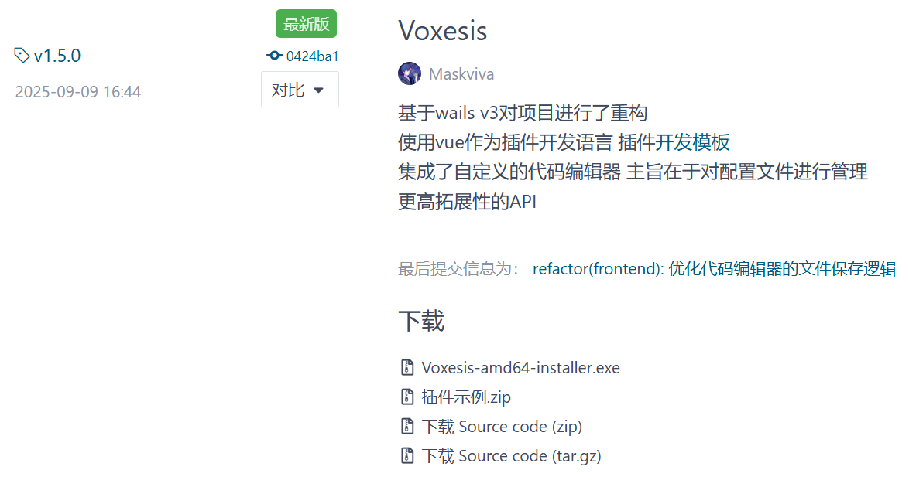
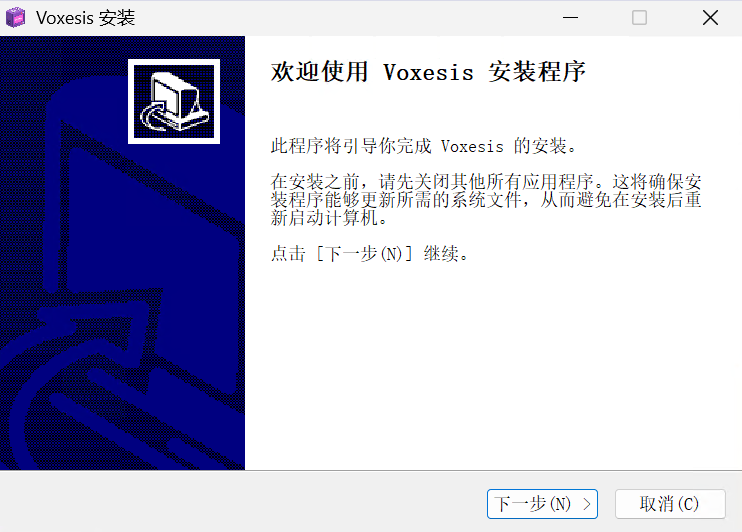
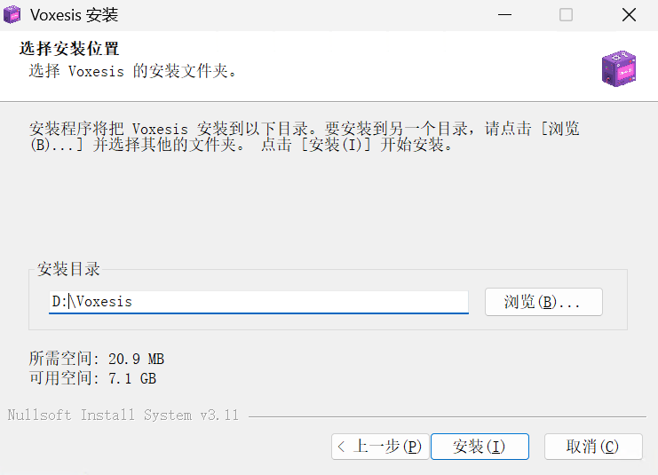
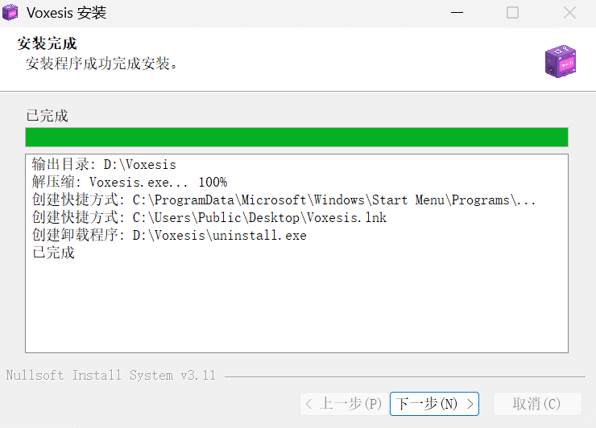
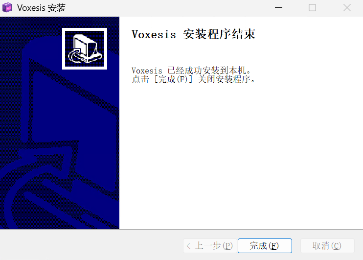

# 使用指南

## 系统要求

在开始安装之前，请确保您的系统满足以下要求：

- Windows 版本符合[要求](README.md#受支持的window版本)
- 已安装 [WebView2](https://developer.microsoft.com/zh-cn/microsoft-edge/webview2/?form=MA13LH) 组件

> Voxesis 本身对系统资源占用不高，对硬件要求也不高。但 GUI（用户界面）是在 WebView2 中渲染的，因此会与 CPU 或 GPU 的性能相关。如果出现 Voxesis 进程占用过高的情况，很可能是扩展插件导致的问题。您可以考虑卸载相关扩展或联系扩展开发者进行修复。

## 安装步骤

按照以下步骤安装 Voxesis：

### 1. 下载安装包

访问 Voxesis 开源库的[下载页面](https://gitee.com/Maskviva/voxesis/releases)，推荐选择最新版本，点击 `Voxesis-amd64-installer.exe` 开始下载。

    

### 2. 启动安装程序

下载完成后，双击 `.exe` 文件启动安装程序。

    

### 3. 选择安装位置

点击"下一步"后，选择合适的安装位置，然后点击"安装"。

    

### 4. 完成安装

安装完成后点击"下一步"。

    

### 5. 启动应用

点击"完成"按钮结束安装过程，然后点击桌面的 Voxesis 快捷方式启动应用程序。

    

